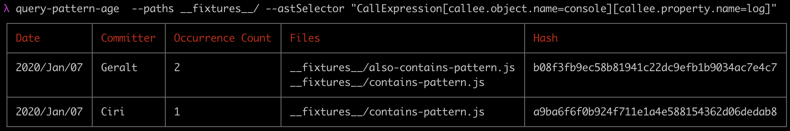

# query-pattern-age
Provide an AST pattern, and see details about when that pattern was introduced to your codebase.



**Why is this useful?** Imagine that you have a large codebase with many contributors, and you want to understand how or why a pattern was introduced. For instance, you have a React app with multiple solutions for styling components: `glamor` and `styled-components`. You want to be able to answer questions like:

1. Which devs are using `glamor`, and which are using `styled-components`?
1. Chronologically, when has each package been used? Do we see a shift over time?

To search for a pattern, specify an [AST selector](https://eslint.org/docs/developer-guide/selectors) as it would be accepted by ESLint. To figure out what AST selector you need, you may find [AST Explorer](https://astexplorer.net/) useful. For instance, to search for `console.log()` calls, we'd pass:

```
--astSelector "CallExpression[callee.object.name=console][callee.property.name=log]"
```

The AST selector syntax is flexible, so you can search for a wide range of patterns. Because you're searching on the AST and not a direct string match, this is far more powerful than doing `grep` across your codebase.

## Usage
This package exports a command line tool, `query-pattern-age`, and an API, via `require('query-pattern-age')`. See the JSDoc typings in the main file of this package for an API reference. Run the command line tool with `--help` for full usage info.

### ESLint Instance
When you invoke the command line tool, it runs `require.resolve('eslint')` in your curent working directory and uses it. This means that if you run this tool in your repo, and you have ESLint installed locally (as you should), that's the version that will be used.

If ESLint changes its command line interface, this tool could break.

## Who Shouldn't Use This
If you have a small codebase and a small team, this may be overkill. You can just talk to the individuals involved. This tool is for helping teams scale past the point where you can't name all the contributors off the top of your head.

## Limitations
Ignore time zones because for our granularity, it doesn't matter.

## Future Work
* Add more exhaustive tests